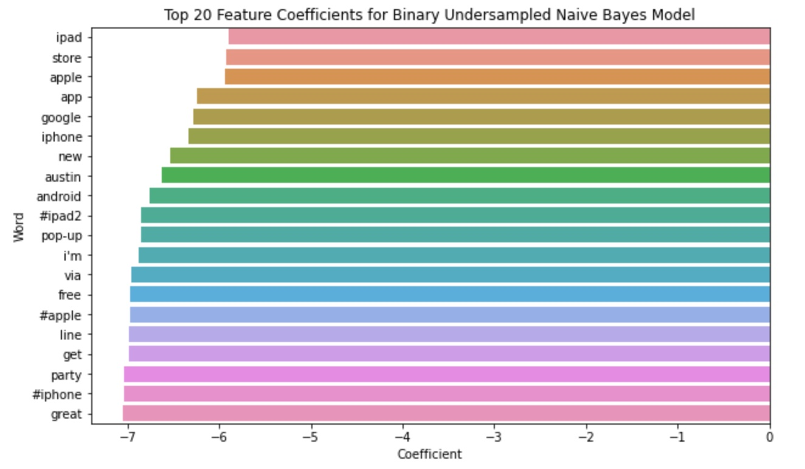

# Twitter Sentiment and Modeling

## Overview

This project utilizes a dataset from CrowdFlower, analyzing and rating the sentiment of Twitter users regarding Apple and Google products by building an NLP model. Human raters rated the sentiment in over 9,000 Tweets as positive, negative, or neither.

## Business Problem

Apple and Google want to gather information on the consensus of their products. They are looking at Twitter as a medium to gather that information. The task is to build a model that can rate the sentiment of a Tweet based on its content.

## Data Understanding

The dataset used for this project is a csv file ("data.csv"), containing over 9,000 Tweets about Apple and Google products. Human raters rated the sentiment as positive, negative, or neither. The target column is the sentiment column.


## Methods

This project uses descriptive analysis, exploratory data analysis, data visualization, natural language processing, and machine building. This provides key insights to optimizing the predictive ability of customers' satisfaction with brands and products.


## Conclusions

### 1. Apple vs Google

* Apple has more negative tweets than Google (8.8% to 5.5%), but also has significantly more positive tweets (44% to 30%). 
* Apps are very popular for both companies: 89% positive tweets about Android apps, 84% positive tweets about iPhone/iPad apps
* The iPhone has more negative tweets than the Android: 12% to 3% 
* General services related to Apple are significantly more popular than Google: 91% to 80%


### 2. Apple Positive vs Negative Tweets

* There was a lot of enthusiasm for the pop-up store in downtown Austin. 
* There was a lot of enthusiasm about the launch of the iPad2, that seems to have been very successful. 
* The battery of the iPhone and the design of the iPad are frequently mentioned in negative tweets. 
* The term "fascist" is used in reference to Apple in some obviously negative tweets. 


### 3. Google Positive vs Negative Tweets 

* Marissa Mayer is referenced in a positive light in tweets. 
* Google's "Circle" is mentioned frequently, there's seemingly a lot of energy surrounding this from each direction. 
* Some users are critical of the cost of Google products, such as Google TV. 


## Recommendations

### 1. Apple 

* Improve upon the design of the iPad. 
* The pop-up store was very successful, look into more strategies similar to this. 

### 2. Google

* Marissa Mayer is a respected individual in majority of social media activity, she should be regarded as such.
* Look at ways to cut down on the prices of higher end tech products. 

## Next Steps 

* Gather more data. We only had about 9,000 tweets in total, with a large chunk of them being marked neutral and making for a smaller sample size for our binary classifier. 
* Harness more negative tweets. The imbalance in which there are thousands more neutral tweets than negative tweets really don't help us with making assessments. 
* Continue to tweak the models and explore different types of models not used here.

## For More Information

See the full analysis in the [Jupyter Notebook](./notebook.ipynb) or review this [presentation](./presentation.pdf).

See the dataset used by clicking [here](./data.csv).

Author: Christopher Miley 

July 10, 2024

## Repository Structure

```
├── images
├── README.md
├── data.csv
├── notebook.ipynb
└── presentation.pdf
```

